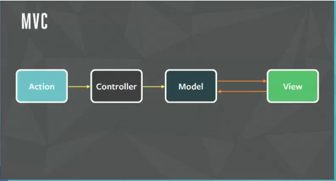
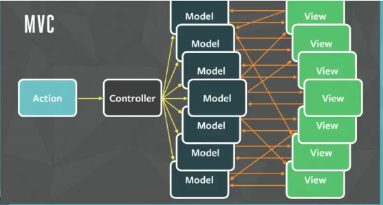
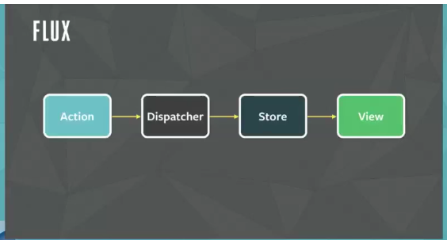
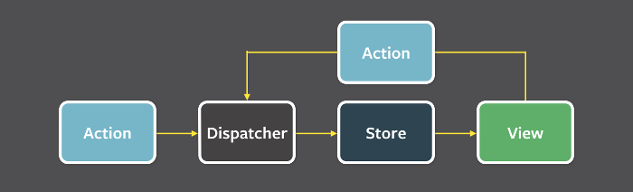

# Flux

Flux is a software architecture philosoph.

Official doc: Flux: https://facebook.github.io/flux/
Introduction video: https://www.youtube.com/watch?list=PLb0IAmt7-GS188xDYE-u1ShQmFFGbrk0v&time_continue=624&v=nYkdrAPrdcw
quick start tutorial: http://www.ruanyifeng.com/blog/2016/01/flux.html

## Mvc does not solve scale problem to big applications

For small projects, mvc works good

what about if for big application with many views and models.

## How Flux solve scalebility problem

Flux, it's a single directional data flow and that avoid all of the double arrows that going that going both directions that make it really hard to understand the system.

