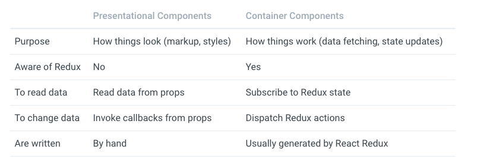

# Redux

**Redux attempts to make state mutations predicatable** by imposing certain restrictions on how and when updates can happen. These restrictions are reflected in the **three principles** of Redux.

## Core Concepts

### State.

**The only way to change the state is to emit an action, an object describing what happened.**

A possible state for an app:

```javascript
{
  todos:[
    {
      text: 'Eat food',
      completed: true
    }, {
      text: 'Excersise',
      completed: false
    }
  ],
  visibilityFilter: 'SHOW_COMPLETED'
}
```

Possible actions for an App

```javascript
{ type: 'ADD_TODO', text: 'Go to swimming pool' }
{ type: 'TOGGLE_TODO', index: 1 }
{ type: 'SET_VISIBILITY_FILTER', filter: 'SHOW_ALL' }
```

To tie state and actions togther, we write a **pure function** called a reducer. Reducer takes state and actions as argument, and return the next state of the app.

```javascript
function reducer(state = {}, action) {
  let { type, payload } = action
  switch (type) {
    case 'ADD_TODO':
      return {
        ...state,
        todos: [
          ...state.todos,
          payload
        ]
      }
    default:
      return state
  }
}
```

## Three Principles of Redux

Redux can be described in three fundamental principles.

### Single source of truth

**The state of your whole application is stored in an object tree within a single store.**

### State is read-only

**The only way to change the state is to emit an action, an object describing what happened.**.

### Changes are made with pure functions

**To specify how the state tree is transformed by actions, you write pure reducers.**
Reducers are just pure functions that take the previous state and an action, and return the next state. Remember to return new state objects, instead of mutating the previous state.

## Prior Art

### Flux

More introductions and tutorials about Flux, please refer to:

-1. quick start: http://www.ruanyifeng.com/blog/2016/01/flux.html

-2. official document: https://facebook.github.io/flux/docs/overview.html

-3. introduction video: https://www.youtube.com/watch?v=nYkdrAPrdcw&t=561s

-4. Notes: [Flux Note](./Flux.md)

### Immutable

**Redux doesn't care how you store the state—it can be a plain object, an Immutable object, or anything else.**.

### Baobab

​Baobab is another popular library implementing immutable API for updating plain JavaScript objects.

## Learning Resources

## Basic concepts

### Actions

#### How an Action looks like(the boilerplate of an action)

**Actions** are payloads of information that send data from your application to your store. They are the only source of information for the store.
You sned them to the store usign ***store.dispatch()**.

An example action which represents adding a new todo item:

```javascript
const ADD_TODO = 'ADD_TODO'
let anAction = {
  type: ADD_TODO,
  text: 'Build my first Redux app'
}
```

##### Action Creators

**Action creators** are exactly that-functions that create actions.

```javascript
function addTodo (text) {
  return {
    type: ADD_TODO,
    text
  }
}
```

In **traditonal Flux**, action creators ofen trigger a dispatch when invoked. like so:

```javascript
function addToDoWithDispatch(text) {
  const action = {
    type: ADD_TODO,
    text
  }
  dispatch(action)
}
```

In Redux this is not the case. Instead, to actually initiate a dispatch, pass the result to the **dispatch()* function:

```javascript
dispatch(addTodo(text))
dispatch(completeTodo(text))
```

Alternatively, you can create a bound action creator that automatically dispatches:

```javascript
const boundAddTodo = text => dispatch(addTodo(text))
const boundCompleteTodo = index => dispatch(completeTodo(index))
```

Now you'll be able to call them directlly:

```javascript
boundAddTodo(text)
boundCompleteTodo(index)
```

**redux-react**  **connect**

### Reducers

Reducers specify how the application's state changes in response to actions sent t o the store.

The reducer is a pure function that takes the previous state and an action, and returns the next state.

```javascript
(prevState, action) => newState
```

## Basic

### Basic: Actions

**Actions** are payloads of informatin that send dat from your application to store. You send information by **store.dispatch**.

#### Basic: ACtion Creators

**Action creatros** are exactly that - functions that create actions. It's easy to conflate the terms "action" and "action creator".
Here is an exmple of action creator:

```javascript
function addTodo(text) {
  return {
    type: ADD_TODO,
    text
  }
}
```

In traditonal Flux, action creators often trigger a dispatch when invoked, like so:

```javascript
function addTodo(text) {
  const action = {
    type: ADD_TODO,
    text
  }
  dispatch(acton)
}
```

In Redux this is not the case.
Instead, to actually initiate a dispatch, pass the result to the **dispatch()** function:

```javascript
dispatch(addTodo(text))
dispatch(completeTodo(index))
```

Alternatively, you can create a bound action creator that automatically dispatches:

```javascript
const boundAddTodo = text => dispatch(addTodo(text))
```

### Basic:Reduers

**Reducers** specify how the state updates when you dispatch actions.

Return a new state instead of write directly to state of its filed.

#### Splicing reducers

```javascript
import { comebindReducer } from 'redux'
import * as reducers from './reducers'
export default comebindReducer(reducers)
```

### Basic: Store

#### Create a store

```javascript
import { createStore } from 'redux'
import todoApp from './reducers'
const store = createStore(todoApp)
```

#### API of Store

- store.getState()

- store.dispatch(action)

- store.subscribte(listener)

Whenever there is a change to state, callback function for **store.subscribe** excutes automatically. Listener function can unsubscribe state change, here is an example:

```javascript
const store  = createStore(reducers)
const callback = () => {
  console.log(store.getState())
}
const unsubscribe = store.subscribe(callback)

const $btn = document.getElementById('unBindBtn')

$btn.addEventListener('click', () => {
  unsubscribe
}, false)
```

### Basic: Data Flow

Redux architecture revolves around a **strict unidirectional data flow.**

The data lifecycle in any Redux app follows these 4 steps:

- You call **store.dispatch(action)**

- **The Redux store calls the reducer function you gave it**

- **The root reducer may combine the output of multiple reducers into a single state tree.**

- **The Redux store saves the complete state tree returned by the root reducer.**

### Usage with React

From the very beginning, we need to stress that Redux has no relation to React.

React bindings for Redux embrace the idea of **separating presentational and container components.**. An introduction about 
**presentational and container components** is here: https://medium.com/@dan_abramov/smart-and-dumb-components-7ca2f9a7c7d0.

The  comparasion for **presentation component** and **container component** is:



**React Redux** has some performance optimaztion that are hard to do by hand.  Generally, we use **connect**, a function provided by **React-Redux**, to gennerate **container components**.

#### Designing Component Hierarchy
