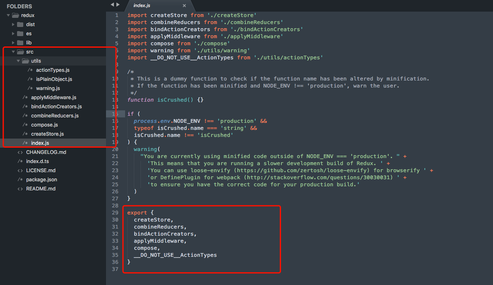

# Redux and its plugin source code reading

## source code structure



## index.js

We can import functions we want from redux in this form:

```javascript
import { createStore } from 'redux'
```

So how can it work in this way, the reasone can be found at */node_modules/redux/index.js*

```javascript
import createStore from './createStore'
import combineReducers from './combineReducers'
import bindActionCreators from './bindActionCreators'
import applyMiddleware from './applyMiddleware'
import compose from './compose'
import warning from './utils/warning'
import __DO_NOT_USE__ActionTypes from './utils/actionTypes'

export {
  createStore,
  combineReducers,
  bindActionCreators,
  applyMiddleware,
  compose,
  __DO_NOT_USE__ActionTypes
}
```

A **store** is the core of a redux app, we can create a store object by:

```javascript
import { createStore, applyMidlewares } from 'redux'

import reducers from './reducers'
import middlewares from './middlwares'

const initialState = {}
export const store = createStore(reducers, initialState, applyMidlewares[...middlewares])
```

A store has the following properties:

- dispatch: dispatch an action

- subscribe: subscribe state change and callback listeners for state's change

- getState: get current state of store

- replaceReducers

All these features for store comes from *createStore.js*. As the returned object for *createStore* function is

```javascript
return {
  dispatch,
  subscribe,
  getState,
  replaceReducer,
  [$$observable]: observable
}
```

Here is the source code and explanation of *createStore.js*:

## createStore.js

```javascript
export default function createStore(reducer, preloadedState, enhancer) {
  // preloadState can be a function
  if (typeof preloadedState === 'function' && typeof enhancer === 'undefined') {
    enhancer = preloadedState
    preloadedState = undefined
  }

  if (typeof enhancer !== 'undefined') {
    if (typeof enhancer !== 'function') {
      throw new Error('Expected the enhancer to be a function.')
    }
    //an enhancer return a store with createStore
    return enhancer(createStore)(reducer, preloadedState)
  }

  if (typeof reducer !== 'function') {
    throw new Error('Expected the reducer to be a function.')
  }

  /*
    some other codes
  */
  return {
    dispatch,
    subscribe,
    getState,
    replaceReducer,
    [$$observable]: observable
  }
}
```

Creating a store with enhancers, the redux-middlwares, needs the help of *applyMiddlewares*:

```javascript
const store = createStore(reducers, initialState, applyMiddlewares([...middlewares]))
```

The *createStore* function will excute:

```javascript
if (typeof enhancer !== 'undefined') {
  if (typeof enhancer !== 'function') {
    throw new Error('Expected the enhancer to be a function.')
  }
  //an enhancer return a store with createStore
  return enhancer(createStore)(reducer, preloadedState)
}

if (typeof reducer !== 'function') {
  throw new Error('Expected the reducer to be a function.')
}
```

So how the enhancer looks like and how it return a similar object like:

```javascript
return {
  dispatch,
  subscribe,
  getState,
  replaceReducer,
  [$$observable]: observable
}
```

Let's dive in source code of *applyMiddleware*:

```javascript
import compose from './compose'

export default function applyMiddleware(...middlewares) {
  return createStore => (...args) => {
    const store = createStore(...args)
    let dispatch = () => {
      throw new Error(
        `Dispatching while constructing your middleware is not allowed. ` +
          `Other middleware would not be applied to this dispatch.`
      )
    }

    const middlewareAPI = {
      getState: store.getState,
      dispatch: (...args) => dispatch(...args)
    }
    const chain = middlewares.map(middleware => middleware(middlewareAPI))
    dispatch = compose(...chain)(store.dispatch)

    return {
      ...store,
      dispatch
    }
  }
}
```

## middlewares

A middleware of redux is a function, which is a transformation of *store.dispatch*. It would do something before dispatch an action and call reducers.

Take a logger as an example:

```javascript
store.dispatch(addTodo('Use Redux'))
```

To log the action and state, you can change it to something like this:

- attempt 1

```javascript
const action = addTodo('Use Redux')
console.log('dispatching', action)
store.dispatch(action)
console.log('next state is', store.getState())
```

- attempt 2

We can extract logging into a function:

```javascript
function dispatchAndLog(store, action) {
  console.log('dispatching', action)
  store.dispatch(action)
  console.log('next state', store.getState())
}
```

- atempt 3

```javascript
const next = store.dispatch
store.dispatch = function dispatchAndLog(action)  => {
  console.log('dispatching', action)
  let result = next(action)
  console.log('next state is', store.getState())
  return result
}
```